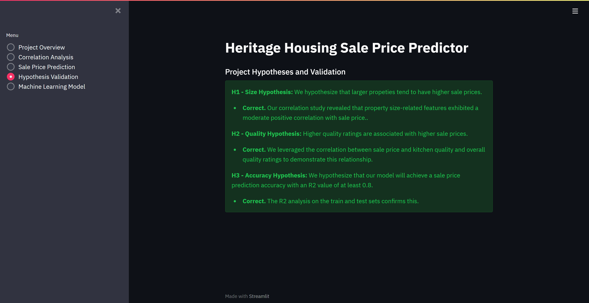

# Heritage Housing Issues

**Data Analysis and Predictive Modelling Study**

**Developed by: Emmanuel Quaynor**

**Live Site:** [Live webpage](https://property-price-predictor-6342850451bd.herokuapp.com/)

**Link to Repository:** [Repository](https://github.com/equaynor/heritage-housing-issues)

## Table of Contents

1. [Introduction](#1-introduction)
2. [Dataset Content](#2-dataset-content)
3. [Business Requirements](#3-business-requirements)
    - [CRISP-DM Workflow](#crisp-dm-workflow)
    - [User Stories](#user-stories)
4. [Hypotheses and Validation](#4-hypotheses-and-validation) 
5. [Rationale to map the business requirements to the Data Visualizations and ML tasks](#5-rationale-to-map-the-business-requirements-to-the-data-visualizations-and-ml-tasks)
6. [ML Business Case](#6-ml-business-case)
7. [Dashboard Design](#7-dashboard-design)
    - [Page 1: Project Summary](#page-1-project-summary)
    - [Page 2: Sale Price Correlation Analysis](#page-2-sale-price-correlation-analysis)
    - [Page 3: Sale Price Prediction](#page-3-sale-price-prediction)
    - [Page 4: Hypothesis and Validation](#page-4-hypothesis-and-validation)
    - [Page 5: Machine Learning Model](#page-5-machine-learning-model)
8. [Unfixed Bugs](#8-unfixed-bugs)
9. [Deployment](#9-deployment)
10. [Technologies](#10-technologies)
    - [Development and Deployment](#development-and-deployment)
    - [Main Data Analysis and Machine Learning](#main-data-analysis-and-machine-learning)
11. [Credits](#11-credits)
    - [Sources of code](#sources-of-code)
    - [Media](#media)
12. [Acknowledgements](#12-acknowledgements)

## **1. Introduction**

Welcome to the Heritage Housing Issues project, a data science initiative aimed at predicting the sale price of houses in Ames, Iowa. The goal of this project is to develop a machine learning model that can accurately estimate the sale price of houses based on various attributes, including features such as size, quality, and condition.

This Machine Learning Project was developed as the fifth portfolio project during the Code Insititute's Diploma in Full Stack Development. It covers the Predictive Analytics specialization.

## **2. Dataset Content**

* The dataset is sourced from [Kaggle](https://www.kaggle.com/codeinstitute/housing-prices-data). We then created a fictitious user story where predictive analytics can be applied in a real project in the workplace.
* The dataset has almost 1.5 thousand rows and represents housing records from Ames, Iowa, indicating house profile (Floor Area, Basement, Garage, Kitchen, Lot, Porch, Wood Deck, Year Built) and its respective sale price for houses built between 1872 and 2010.

|Variable|Meaning|Units|
|:----|:----|:----|
|1stFlrSF|First Floor square feet|334 - 4692|
|2ndFlrSF|Second-floor square feet|0 - 2065|
|BedroomAbvGr|Bedrooms above grade (does NOT include basement bedrooms)|0 - 8|
|BsmtExposure|Refers to walkout or garden level walls|Gd: Good Exposure; Av: Average Exposure; Mn: Minimum Exposure; No: No Exposure; None: No Basement|
|BsmtFinType1|Rating of basement finished area|GLQ: Good Living Quarters; ALQ: Average Living Quarters; BLQ: Below Average Living Quarters; Rec: Average Rec Room; LwQ: Low Quality; Unf: Unfinshed; None: No Basement|
|BsmtFinSF1|Type 1 finished square feet|0 - 5644|
|BsmtUnfSF|Unfinished square feet of basement area|0 - 2336|
|TotalBsmtSF|Total square feet of basement area|0 - 6110|
|GarageArea|Size of garage in square feet|0 - 1418|
|GarageFinish|Interior finish of the garage|Fin: Finished; RFn: Rough Finished; Unf: Unfinished; None: No Garage|
|GarageYrBlt|Year garage was built|1900 - 2010|
|GrLivArea|Above grade (ground) living area square feet|334 - 5642|
|KitchenQual|Kitchen quality|Ex: Excellent; Gd: Good; TA: Typical/Average; Fa: Fair; Po: Poor|
|LotArea| Lot size in square feet|1300 - 215245|
|LotFrontage| Linear feet of street connected to property|21 - 313|
|MasVnrArea|Masonry veneer area in square feet|0 - 1600|
|EnclosedPorch|Enclosed porch area in square feet|0 - 286|
|OpenPorchSF|Open porch area in square feet|0 - 547|
|OverallCond|Rates the overall condition of the house|10: Very Excellent; 9: Excellent; 8: Very Good; 7: Good; 6: Above Average; 5: Average; 4: Below Average; 3: Fair; 2: Poor; 1: Very Poor|
|OverallQual|Rates the overall material and finish of the house|10: Very Excellent; 9: Excellent; 8: Very Good; 7: Good; 6: Above Average; 5: Average; 4: Below Average; 3: Fair; 2: Poor; 1: Very Poor|
|WoodDeckSF|Wood deck area in square feet|0 - 736|
|YearBuilt|Original construction date|1872 - 2010|
|YearRemodAdd|Remodel date (same as construction date if no remodelling or additions)|1950 - 2010|
|SalePrice|Sale Price|34900 - 755000|

### **Project Terms and Jargon**

* **Sale price** of a house refers to the current market price of a house with certain attributes.

* **Inherited house** is a house that the client inherited from grandparents.

* **Summed price** is the total of the sale prices of the four inherited houses.

## **3. Business Requirements**

Our client, who has inherited four houses in Ames, Iowa, has requested our assistance in maximizing the sales price for these properties. Despite her excellent understanding of property prices in her own state and residential area, she is concerned that relying on her current knowledge may lead to inaccurate appraisals, as the factors that make a house desirable and valuable in her area may differ from those in Ames, Iowa.

Our client has provided us with a public dataset containing house prices for Ames, Iowa. We have agreed to support her in addressing the following business requirements:

* **BR1:** The client is interested in discovering how the house attributes correlate with the sale price. Therefore, the client expects data visualizations of the correlated variables against the sale price to show that.

* **BR2:** The client is interested in predicting the house sales price from her 4 inherited houses, and any other house in Ames, Iowa.

To address these business requirements, we will break down the project into manageable epics and user stories. Each user story will be further divided into tasks, which will be implemented using an agile process. This approach will enable us to deliver a high-quality solution that meets our client's needs and expectations.

### CRISP-DM Workflow

#### **Epic 1: Business Understanding (CRISP-DM Phase 1)**

---

- **Define the Problem**: Clearly articulate the problem statement and identify the client's (Lydia's) goals and objectives.
- **Create User Stories**: Break down the project requirements into smaller, manageable tasks.
- **Create hypotheses and validations**: Define hypotheses and validate them.

#### **Epic 2: Data Understanding (CRISP-DM Phase 2)**

---

- **Collect and Load the Dataset**: Load the dataset and explore its structure, content, and summary statistics.
- **Explore the Data**: Use visualization and summary statistics to understand the distribution of variables and their relationships.
- **Identify Missing Values and Handle Them**: Detect and handle missing values in the dataset.
- **Document the Data**: Document the data, including its sources, quality, and limitations.

#### **Epic 3: Data Preparation (CRISP-DM Phase 3)**

---

- **Clean the Data**: Clean the dataset by handling outliers, encoding categorical variables, and scaling/normalizing numerical variables.
- **Feature Engineering**: Create new features that might be relevant for the model (e.g., feature interactions, transformations).
- **Split the Data**: Split the dataset into training, validation, and testing sets.
- **Document the Data Preparation**: Document the data preparation steps, including data cleaning, feature engineering, and data splitting.

#### **Epic 4: Modeling (CRISP-DM Phase 4)**

---

- **Choose a Model**: Select a suitable machine learning algorithm for the problem (e.g., linear regression, decision trees, random forest).
- **Train the Model**: Train the model on the training data.
- **Evaluate the Model**: Evaluate the model's performance on the validation data using metrics such as mean squared error, R-squared, etc.
- **Hyperparameter Tuning**: Perform hyperparameter tuning to optimize the model's performance.

#### **Epic 5: Evaluation (CRISP-DM Phase 5)**

---

- **Evaluate the Model's Performance**: Evaluate the model's performance on the testing data.
- **Compare Models**: Compare the performance of different models and select the best one.
- **Refine the Model**: Refine the model by incorporating additional features, handling outliers, or using different algorithms.

#### **Epic 6: Deployment (CRISP-DM Phase 6)**

---

- **Create a Dashboard**: Create a dashboard to visualize the model's predictions and insights.
- **Deploy the Model**: Deploy the model in a production-ready environment (e.g., Flask, Django, Streamlit).
- **Monitor and Update the Model**: Monitor the model's performance and update it as necessary to maintain its accuracy.

These steps can be matched up nicely to 6 Epics in the Agile development process. As we move along the pipeline of the development process we may flow back and forth between stages/epics as we learn new insight and have to revisit previous step in order to refine the development. While ultimately moving towards the final delivery of a product that satisfies the users/clients requirements.

### User Stories

**US1:** As a client, I want to discover which attributes of a house are most correlated with its sale price, so that I can understand the key drivers of sale price. (Business Requirement Covered: BR1)

**US2:** As a client, I want to have a reliable prediction of the sale price of my inherited houses, so that I can sell them at the maximum total price possible. (Business Requirement Covered: BR2)

**US3:** As a technical user, I want to understand the machine learning model used to predict the sale price, so that I can trust the accuracy of the predictions. (Business Requirement Covered: BR2)

**US4:** As a client, I want to visualize the relationships between sale price and other features, so that I can gain insights into the importance of different attributes. (Business Requirement Covered: BR1)

**US5:** As a client, I want to have a user-friendly dashboard to input house data and receive predicted sale prices, so that I can easily make informed decisions about pricing and selling. (Business Requirement Covered: BR2)

## **4. Hypotheses and Validation**

We propose the following hypotheses to explain the relationship between house attributes and sale price:

1.  **Size Hypothesis:** Larger properties tend to have higher sale prices. We will investigate correlations between attributes related to house size (e.g. square footage, number of bedrooms) and sale price to validate this hypothesis.
    * Hypothesis confirmed by extensive Correlation Study. The strongest correlating features are: '1stFlrSF', 'GarageArea', 'GrLivArea' and 'TotalBsmtSF'.
2. **Quality Hypothesis:** Higher quality ratings are associated with higher sale prices. We will examine correlations between variables related to house quality (e.g. kitchen quality, overall quality) and sale price to test this hypothesis.
    * Hypothesis confirmed by extensive Correlation Study. The strongest correlating features are: 'KitchenQual_TA' and 'OverallQual'.
3. **Accuracy Hypothesis:** We hypothesize that our model will achieve a sale price prediction accuracy with an R2 value of at least 0.8.
    * Hypothesis confirmed by reaching R2 scores of 0.871 for the train set and 0.809 for the test set.

## **5. Rationale to map the business requirements to the Data Visualizations and ML tasks**

- **Business Requirement 1 (BR1):** Data Visualization and Correlation Study
    
    - We will analyze the distribution of sale prices in the dataset to gain insights into its characteristics.
    - We will investigate the relationships between various attributes and sale prices using Pearson and Spearman correlation analysis.
    - We will visualize the key variables to understand their impact on sale prices.
    - The [Correlation Study notebook](https://github.com/equaynor/heritage-housing-issues/blob/main/jupyter_notebooks/03_correlation_study.ipynb) addresses this business requirement.

- **Business Requirement 2 (BR2):** Regression Analysis
    
    - Since the target variable is continuous, we will employ regression analysis to predict sale prices. If the model performance is poor, we may consider alternative approaches.
    - We aim to identify the most influential attributes driving sale prices, enabling our customer to optimize pricing strategies. We may use Principal Component Analysis (PCA) to identify these variables.
    - The [Modeling and Evaluation notebook](https://github.com/equaynor/heritage-housing-issues/blob/main/jupyter_notebooks/05_model_and_evaluation.ipynb) addresses this business requirement.

## **6. ML Business Case**

### **Predict Sale Price**
#### **Regression Model**

We want an ML model to predict the sale price of houses in Ames, Iowa. The target variable is a continuous number, and we will use a regression model to achieve this goal.

**Ideal Outcome**

Our ideal outcome is to provide our client with a reliable tool to predict the sale price of her inherited houses, as well as any other house with similar attributes. This will enable her to make informed decisions about pricing and selling her properties.

**Model Success Metrics**

The model success metrics are:

- At least 0.75 for R2 score, on both train and test sets
- The model is considered a failure if its predictions are off by more than 25% of the time

**Output**

The output is defined as a continuous value representing the sale price in USD.

**Heuristics**

Our Belgian client, unfamiliar with local property prices, feared her limited knowledge might lead to inaccurate appraisals. She sought our help to maximize the sale price. We employ Machine Learning models and regression algorithms, rather than unreliable heuristics, to ensure accurate property valuation.

**Training Data**

The training data to fit the model comes from a public dataset from Ames, Iowa, which contains approximately 1.5 thousand property sales records and 22 features. We will preprocess the data by dropping variables with more than 75% missing values and selecting the remaining variables as features.

  * Train data: drop variables 'EnclosedPorch' and 'WooddeckSF' because each has more than 75% missing values. 

  * Target variable: SalePrice 

  * Features: all remaining variables.

**Pipeline Steps**

Our pipeline will consist of the following steps:

- Data preprocessing
- Feature selection
- Model training and testing
- Model deployment and maintenance

**Application**

Our model will be useful for our client, who wants to predict the sale price of her inherited houses, as well as for other users who want to estimate the sale price of their own properties. The model can be accessed online, and users can input data for their homes to get a predicted sale price.

 Pipeline steps

## **7. Dashboard Design**

Our dashboard is designed to provide an intuitive and user-friendly interface for our client to explore the relationships between house attributes and sale prices, as well as to predict the sale price of her inherited houses and other houses in Ames, Iowa.

### **Page 1: Project Overview**

This page provides a brief introduction to the project, including:

- A summary of the project's objectives and goals
- Definitions of key terms and concepts used in the project
- An overview of the dataset used, including its source and characteristics
- A statement of the business requirements and how they are addressed in the project
- Links to additional resources and information

Project Summary Page Screenshot

### **Page 2: Correlation Analysis**

This page provides an in-depth analysis of the relationships between house attributes and sale prices. The page includes:

- A feature to display a sample of data from the dataset
- Options to view Pearson and Spearman correlation plots between the features and the sale price
- Options to view histograms and scatterplots of the most important predictive features
- A feature to view Predictive Power Score analysis

Correlation Analysis Page Screenshot

### **Page 3: Sale Price Prediction**

This page allows our client to predict the sale price of her inherited houses and other houses in Ames, Iowa. The page includes:

- An input feature to enter property attributes and generate a predicted sale price
- A display of the predicted sale price
- A feature to predict the sale prices of the client's specific data in relation to her inherited properties

Sale Price Prediction Page Screenshot

### **Page 4: Hypothesis Validation**

This page presents the results of our hypothesis validation, including:

- A list of the project's hypotheses and how they were validated

Hypotheses Page Screenshot

### **Page 5: Machine Learning Model**

This page provides an overview of the machine learning model used to predict the sale price of houses. The page includes:

- Information on the ML pipeline used to train the model
- A demonstration of feature importance
- A review of the pipeline performance

Machine Learning Model Page Screenshot

## **8. Unfixed Bugs**

The app does not currently contain any unfixed bugs.

## **9. Deployment**

### Heroku

* The App live link is: [Property Price Predictor](https://property-price-predictor-6342850451bd.herokuapp.com/)
* Set the runtime.txt Python version to a [Heroku-20](https://devcenter.heroku.com/articles/python-support#supported-runtimes) stack currently supported version.
* The project was deployed to Heroku using the following steps.

1. Log in to Heroku and create an App
2. At the Deploy tab, select GitHub as the deployment method.
3. Select your repository name and click Search. Once it is found, click Connect.
4. Select the branch you want to deploy, then click Deploy Branch.
5. The deployment process should happen smoothly if all deployment files are fully functional. Click the button Open App on the top of the page to access your App.
6. If the slug size is too large then add large files not required for the app to the .slugignore file.

## **10. Technologies

This section provides an overview of the tools and technologies used to complete this project.

### Development and Deployment

- [GitHub](https://github.com/) was used to create the project repository, story project files and record commits.
- [Code Anywhere](https://codeanywhere.com/) served as the development environment.
- [Jupyter Notebooks](https://jupyter.org/) were utilized for data analysis, engineering, and model development.
  - In the terminal type `jupyter notebook --NotebookApp.token='' --NotebookApp.password=''` to start the jupyter server.
- [Heroku](https://www.heroku.com/) was used to deploy the project.
- [Kaggle](https://www.kaggle.com/) provided access to the dataset
- [Streamlit](https://streamlit.io/) was employed to create the online app interface.

### Main Data Analysis and Machine Learning

- [NumPy](https://numpy.org/) was used for mathematical operations, such as calculating means, modes, and standard deviations.
- [Pandas](https://pandas.pydata.org/) was used for data manipulation, including reading and writing files, inspecting data, and creating and manipulating series and dataframes.
- [ydata_profiling](https://ydata-profiling.ydata.ai/docs/master/index.html) was used to generate an extensive Profile Report of the dataset.
- [PPScore](https://pypi.org/project/ppscore/) was used to determine the predictive power score of the data features.
- [MatPlotLib](https://matplotlib.org/) and [Seaborn](https://seaborn.pydata.org/) were used for constructing plots to visualize the data analysis, specifically the heatmaps, correlation plots and historgram of feature importance.
- [Feature Engine](https://feature-engine.trainindata.com/en/latest/index.html) was used for various data cleaning and preparation tasks:
  - Dropping Features, and Imputation of missing variables.
  - Ordinal Encoding, Numerical Transformations, Assessment of outliers, and Smart Correlation Assessment of variables.
- [SciKit Learn](https://scikit-learn.org/stable/) was used for machine learning tasks, including:
  - Splitting train and test sets.
  - Feature processing and selection.
  - Gridsearch to determine the optimal regression model.
  - Gridsearch to determine the optimal hyperparameters.
  - Model evaluation using R2 score
  - Principal Component Analysis and evaluation.
- [XGBoost](https://xgboost.readthedocs.io/en/stable/) was used for the XGBoostRegressor algorithm.

## **11. Credits**

This project drew upon various sources of code to inform its development. Specifically:

*  The CI Churnometer Walkthrough Project and CI course content provided inspiration for several functions and  classes, including:
* Hyperparameter optimization search
* Feature importance analysis
* Evaluation of train and test sets
* Predictive power score (PPS) and correlation analysis and plots
* Missing data evaluation
* Data cleaning effect
* These code snippets were incorporated into the Jupyter Notebooks used during the project's development process.
* The CI Churnometer Walkthrough Project also served as a template for the Streamlit pages, which were modified and adapted for use in this project.
* More broadly, the walkthrough project provided a general framework for the project's layout and flow, guiding the development process.

### **Acknowledgements**

Many thanks and appreciation go to the following sources and people:

- Several past projects provided valuable additional information on how to complete a successful project:
  - Heritage Housing Issues project by Amare Teklay Hailu [Link](https://github.com/Amareteklay/heritage-housing-issues)
  - Heritage Housing Issues project by Ulrike Riemenschneider [Link](https://github.com/URiem/heritage-housing-PP5/tree/main)
- The Slack community has, as always, been invaluable in answering questions. For this project a particular thank you to Niel McEwen. As the moderator of the Predictive Analytics PP5 Slack channel he was the main person to help resolve several technical issues.
- My mentor Mo Shami provided great feedback on how to improve the project in our mentor meetings.
- As always a big thank you to my wife, Tasha, for her continued, unwavering support!

